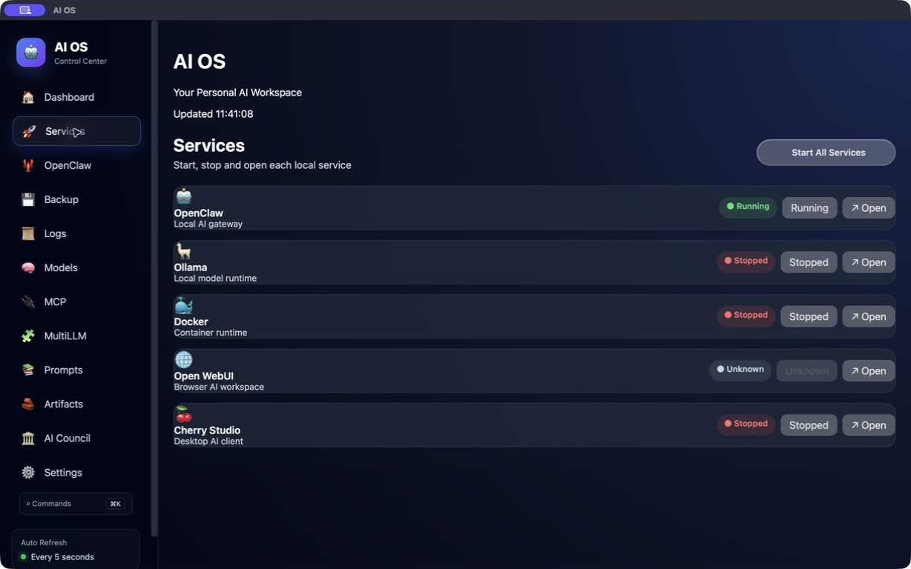
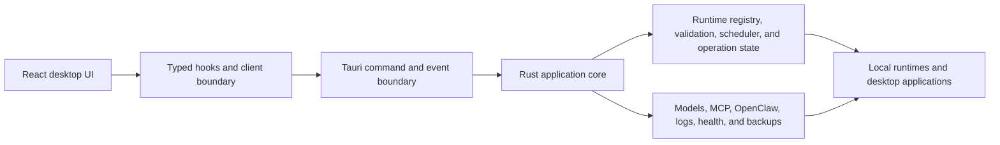

# AI-OS

**A local-first desktop control layer for running and supervising personal AI services.**

AI-OS brings local AI runtimes, model tools, gateway connections, system status, logs, and backups into one desktop workspace. It is built for people who want local control without managing every service through separate terminals and configuration files.

> **Project status:** Active, early-stage development. AI-OS is not yet a stable production release. The current application and packaging are macOS-oriented, and several integrations require their corresponding third-party services to be installed separately.

## Product preview



_A native macOS development build detecting local AI services. Runtime availability depends on what is installed and configured on the host._

## Why AI-OS?

A local AI setup often spans model servers, container tools, agent gateways, browser interfaces, configuration files, and background processes. AI-OS is developing a common operating layer above those components: one interface for observing their state and coordinating supported lifecycle operations.

The project is provider-neutral by design. It does not aim to replace Ollama, OpenClaw, Docker, Open WebUI, or other runtimes; it coordinates and exposes supported operations from a unified desktop application.

## What works today

The repository currently includes:

- A dashboard for runtime health, service status, and macOS CPU, memory, and disk metrics.
- Runtime discovery and status reporting for OpenClaw, Ollama, Docker Desktop, Open WebUI, and Cherry Studio.
- Typed start, stop, and open operations where a runtime advertises those capabilities.
- Start-all and stop-all coordination through the same canonical runtime-operation path.
- A process-wide FIFO scheduler, lifecycle validation, bounded operation admission, operation progress, cancellation, and error reporting.
- Ollama model listing, pulling, inspection, execution, and deletion.
- Multi-model streaming with cancellation.
- MCP server configuration management.
- OpenClaw server profiles, connection testing, active-server selection, import/export, status summaries, and gateway invocation.
- Local logs, health checks, application settings, and backup/restore workflows.
- Prompt library, artifacts, and AI Council interface surfaces.

Some screens and integrations are still evolving. Availability of an action depends on the host platform, installed software, configured endpoints, and the runtime's advertised capabilities.

## Architecture



Runtime operations follow a shared execution model:

1. The frontend requests an operation through a typed Tauri boundary.
2. The Rust backend validates the runtime, action, and current lifecycle state.
3. Admission control accepts or rejects the request.
4. A process-wide scheduler serializes individual and bulk lifecycle work.
5. Canonical operation state and events report progress, completion, cancellation, or failure to the UI.

This separation keeps presentation state out of lifecycle execution and gives individual and bulk actions a consistent path.

## Technology

- **Desktop shell:** Tauri 2
- **Native backend:** Rust, Tokio, Serde, Reqwest, Tungstenite
- **Frontend:** React 19, TypeScript, Vite
- **Content rendering:** React Markdown, Mermaid, KaTeX, Highlight.js
- **Current packaging target:** macOS application and DMG

## Run from source

### Prerequisites

The current codebase is macOS-oriented. Before starting, install:

- macOS 11 or later
- Node.js 18 or later and npm
- The stable Rust toolchain
- The [Tauri 2 prerequisites for macOS](https://v2.tauri.app/start/prerequisites/)
- Any optional runtime you want AI-OS to manage, such as Ollama, Docker Desktop, Open WebUI, OpenClaw, or Cherry Studio

Clone and run the desktop application:

```bash
git clone https://github.com/russellchen001/AI-OS.git
cd AI-OS
npm install
npm run tauri:dev
```

Build a release bundle:

```bash
npm run tauri:build
```

The frontend-only development server can be started with `npm run dev`, but native features require the Tauri application.

## Configuration and safety

Runtime endpoints and integration settings are configured in the application. Operations are routed through typed commands and explicit runtime capabilities, but AI-OS can still start or stop local software and modify its own saved configuration. Review settings and backups before using it with important environments.

Do not commit API keys, access tokens, private endpoints, or personal backup data. Please report security-sensitive issues privately to the maintainer rather than opening a public issue with secrets or exploit details.

## Roadmap

The roadmap reflects intended work, not currently available guarantees:

- Publish reproducible developer releases and signed installation artifacts.
- Expand automated tests for Rust lifecycle logic, frontend boundaries, and integration behavior.
- Document runtime adapters and make new integrations easier to contribute.
- Improve diagnostics, recovery guidance, accessibility, and onboarding.
- Add broader cross-platform support after platform-specific operations are isolated.
- Develop provider-neutral agent and workflow orchestration through typed, auditable tool interfaces.
- Add repeatable evaluations for tool calls, structured outputs, recovery behavior, and runtime-action safety.
- Improve contributor documentation, sample configurations, and demonstration workflows.

Priorities may change as the architecture and contributor community develop.

## Contributing

AI-OS is currently led by Russell Chen and welcomes focused, reviewable contributions.

1. Open an issue before starting a large feature or architectural change.
2. Fork the repository and create a narrowly scoped branch.
3. Keep Rust, TypeScript, and Tauri IPC contracts aligned.
4. Add or update tests and documentation where the change affects behavior.
5. Verify the relevant development and build commands.
6. Open a pull request describing the problem, approach, limitations, and manual verification.

Useful contribution areas include runtime adapters, tests, documentation, accessibility, diagnostics, and platform portability. By contributing, you agree that your contribution is licensed under Apache-2.0.

## Codex Open Source Fund

AI-OS is being prepared for an application to the [OpenAI Codex Open Source Fund](https://openai.com/form/codex-open-source-fund/). The project has not claimed or received funding through this README.

If credits are awarded, the intended open-source uses are:

- Implementing and evaluating provider-neutral agent orchestration.
- Developing typed configuration assistance and runtime diagnostics.
- Using Codex for implementation, refactoring, tests, documentation, issue analysis, and contributor onboarding.
- Running regression evaluations for tool-call correctness, structured outputs, recovery, and safe runtime actions.
- Supporting limited contributor testing and public reference workflows.

OpenAI-backed features would be integrations within a provider-neutral, inspectable, locally controlled core. Any future hosted demonstrations or credit-supported access would be documented separately with clear limits.

## License

Copyright 2026 Russell Chen.

Licensed under the [Apache License 2.0](LICENSE).
